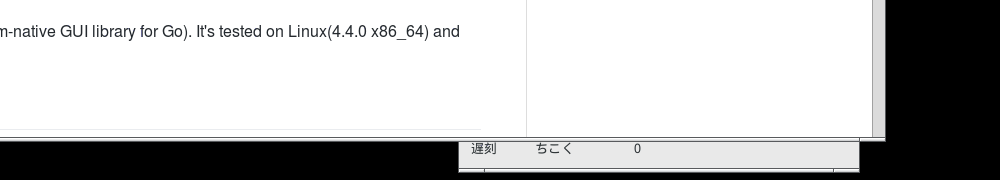

## Introduction

This program shows contents of a plain text file line by line in a certain period. It's designed for people who is learning new languages or anyone who need to remember or review a lot of unrelated small things.

The program is pretty simple to use, and this is how it looks:


After you started the software, choosed the file to display, then you can put it into the corner of your screen, then start your daily work.



This program is based on the [andlabs/ui][1] project(A Platform-native GUI library for Go). It's tested on Linux(4.4.0 x86_64) and MS Windows(Windows7 x64).


## Building

First you need to have [Go language][3] tools installed. For Chinese users, you can get it from [here][4]. After that, enter the program directory, build it with this:

```sh
go build
```

For Windows, to eliminate the useless cmd window, you need to add some build flags:
```sh
go build -ldflags -H=windowsgui
```

## Prebuild

There is a prebuild binary for MS Windows. [Click][2] to download it.


[1]: https://github.com/andlabs/ui/
[2]: https://github.com/wallacegibbon/lineslide/blob/master/prebuild/lineslide.exe.bz2?raw=true
[3]: https://golang.org/
[4]: https://golang.google.cn/
